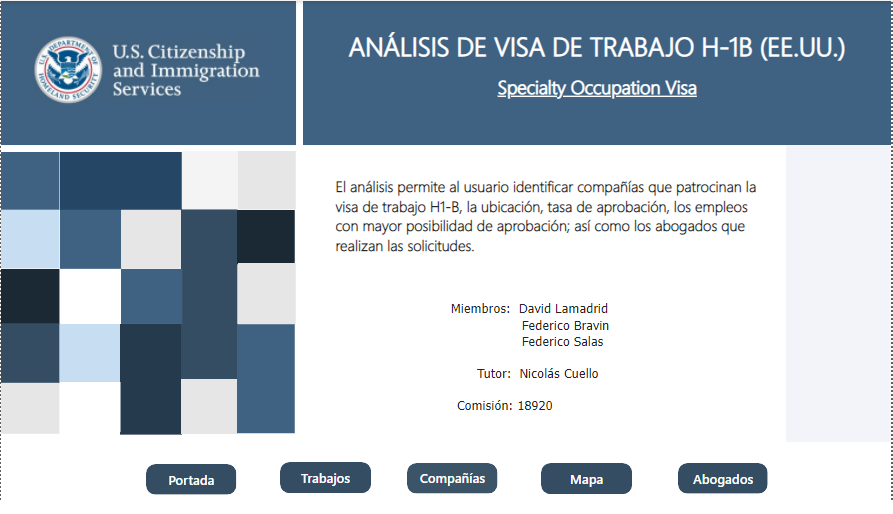
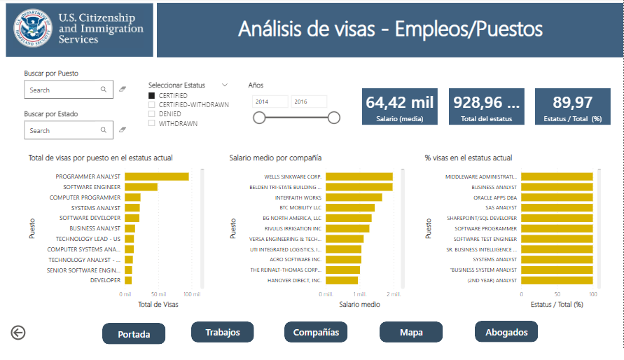
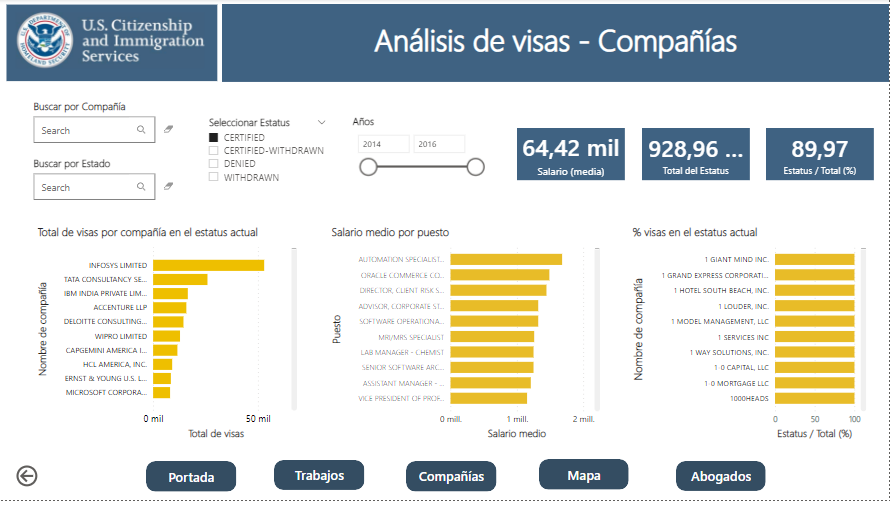
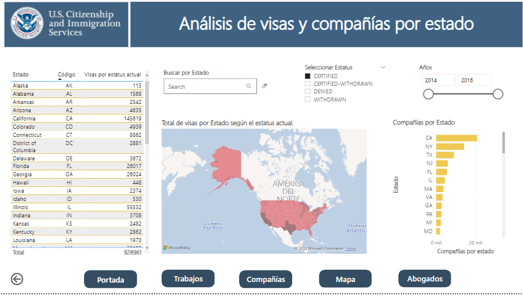
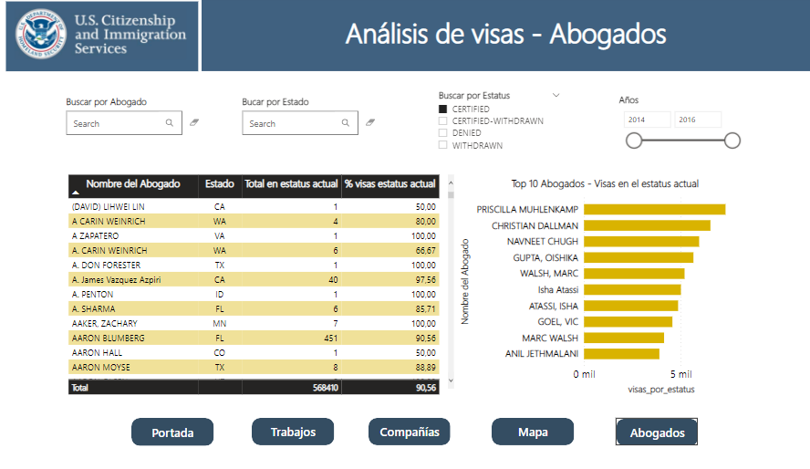

# Español
Proyecto final hecho durante la cursada de análisis de datos dictado en [coderhouse](https://us.coderhouse.com/). 
El proyecto elegido es un análisis de las visas del tipo H1-B de Estados Unidos.
Estas visas están reservadas para trabajos que requieren algún tipo de titulación.

# English
Final project done during the data analysis course taught at [coderhouse](https://us.coderhouse.com/). 
The chosen project is an analysis of H1-B visas in the United States.
These visas are reserved for jobs that require some type of degree.

# Technologies
* SQL
* Excel
* Power BI

# Storytelling
# Español

La idea para este proyecto parte de la necesidad de los Estados Unidos de encontrar talento en ocupaciones especializadas proveniente de otros países. 
Esto es posible por medio de una visa de trabajo H-1B, la cual no solo permite al candidato inmigrar temporalmente a los Estados Unidos, sino que, tras una serie de renovaciones abre la puerta a la residencia y eventual ciudadanía.
El proceso no es tan fácil ya que se involucran diferentes factores:
1. El candidato debe haber cursado una licenciatura de acuerdo con la lista de profesiones enlistadas en los requerimientos de la visa.
2. El candidato también debe contar con años de experiencia laboral suficiente
3. El candidato debe haber recibido una oferta laboral de una empresa establecida en los Estados Unidos. La empresa debe comprobar que no ha cubierto la vacante con talento doméstico o que el nivel de especialización es muy particular y el candidato llena el perfil
4. La oferta laboral debe incluir un salario, y este salario no puede estar por debajo de lo que ganaría un profesional doméstico en el mismo puesto
5. La empresa debe estar dispuesta a patrocinar el costo de la solicitud y la contratación de un abogado de inmigración
6. La visa H-1B tiene un límite en cuanto al número de solicitudes cada año.

El primer punto para evaluar son los trabajos/empleos; es decir, cuáles son los puestos que tienen la mayor cantidad de visas aprobadas (certificadas).
También es posible que el candidato esté interesado en buscar una ocupación y que la compañía que ha ofrecido esta oportunidad laboral se encuentre en algún estado especifico.

Posiblemente, el candidato tenga un interés particular por conocer todas las vacantes para las cuales la compañía ha patrocinado la visa H-1B. 
De acuerdo con su preparación profesional y experiencia, el candidato podría ser considerado para diferentes posiciones.

Si el candidato tiene un interés particular por buscar una oportunidad laboral en algún estado de la Unión Americana, puede realizar una búsqueda.

Una clave importante de este proceso es contar con la orientación legal adecuada. 
Algunos candidatos han visto truncado su proceso; y no ha sido por la falta de una oferta laboral, una compañía que pague los honorarios de los abogados o los costos de la solicitud ante el gobierno. 
Estos candidatos se han asesorado por abogados que no tienen la experiencia necesaria o que han cometido errores cruciales durante el proceso de solicitud de visa y sus solicitudes son rechazadas.

# English

The idea for this project stems from the need for the United States to find talent in specialized occupations from other countries. 
This is made possible through an H-1B work visa, which not only allows the candidate to immigrate temporarily to the United States, but, after a series of renewals, opens the door to residency and eventual citizenship.
The process is not so easy as different factors are involved:
1. The candidate must have pursued a bachelor's degree in accordance with the list of professions listed in the visa requirements.
2. The candidate must also have years of sufficient work experience.
3. The candidate must have received a job offer from a company established in the United States. The company must prove that it has not filled the vacancy with domestic talent or that the level of specialization is very particular and the candidate fits the profile.
4. The job offer must include a salary, and this salary cannot be below what a domestic professional would earn in the same position.
5. The company must be willing to sponsor the cost of the application and the hiring of an immigration attorney.
6. The H-1B visa has a limit on the number of applications each year.

The first point to evaluate is the jobs; that is, which positions have the highest number of approved (certified) visas.
It is also possible that the candidate is interested in looking for an occupation and that the company that has offered this job opportunity is located in a specific state.

The candidate may have a particular interest in learning about all the vacancies for which the company has sponsored the H-1B visa. 
Based on his or her professional qualifications and experience, the candidate may be considered for different positions.

If the candidate has a particular interest in pursuing a job opportunity in any state in the U.S., a search may be conducted.

An important key to this process is proper legal guidance. 
Some candidates have had their process truncated; and it has not been for lack of a job offer, a company to pay the attorneys' fees or the costs of applying to the government. 
These candidates have been advised by lawyers who do not have the necessary experience or who have made crucial mistakes during the visa application process and their applications are rejected.
